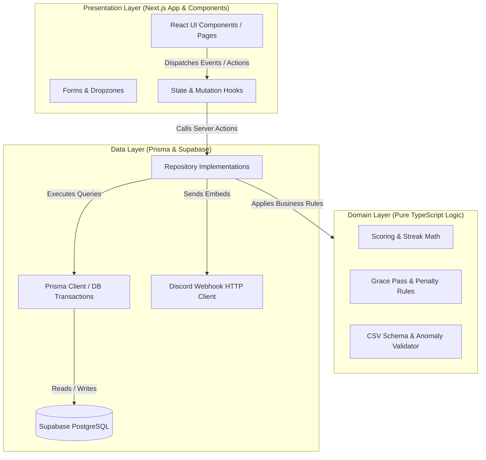
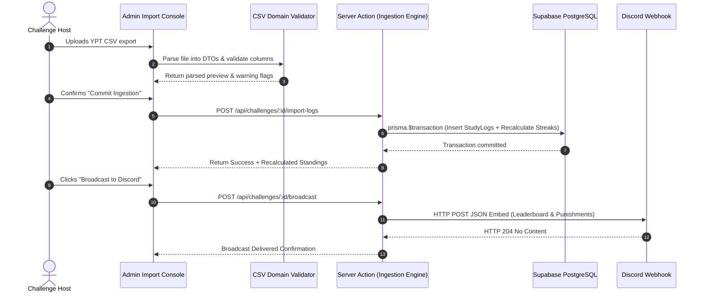

# ARCHITECTURE.md — System Architecture & Implementation Blueprint

> **Project:** HoldMeToIt (Gamified Study Accountability & Challenge Management Platform)  
> **Platform Status:** **PENDING GROUP RATIFICATION** (Candidate A: Next.js 14+ / Prisma; Candidate B: React + Node/Express; Candidate C: React + FastAPI)  
> **Reference Architecture:** Feature-First Clean Architecture & Relational PostgreSQL  
> **Source of Truth:** Repository root. Applies to all engineering agents & human contributors.  

---

## 1. Architectural Philosophy & Core Laws

HoldMeToIt enforces a **Feature-First Clean Architecture**. While the specific web framework remains subject to group consensus, the architectural boundaries, domain mathematics, and relational database schema defined here are **universal and framework-agnostic**.

### Foundational Constraints & Laws
1. **The Inward Dependency Rule:** The `domain/` layer contains pure business logic and math (scoring, streak calculations, grace day deductions). It must **NEVER** import UI components, framework routing, or ORM/database clients. This logic can run unchanged regardless of the final framework chosen.
2. **Single Entity Unity (Law L1):** Solo, Duo, and Squad battles are mathematically identical. A "Solo" is simply a Team where `maxMembers = 1`. A "Duo" has `maxMembers = 2`. All leaderboard calculations aggregate over `Team` entities.
3. **Optimistic & Resilient Data Flow:** Mutations (like manual hours adjustments) commit to PostgreSQL via atomic transactions before cache updates.
4. **Zero-State Primacy (Law L6):** Every feature component must handle Loading, Empty, and Error states cleanly.

---

## 2. Architecture Pattern (Feature-First Directory Structure)

The repository separates shared infrastructure (`core/`) from discrete vertical business capabilities (`features/`):

```text
HoldMeToIt/
├── app/                           # Next.js App Router (Routing Shell)
│   ├── (auth)/                    # Public & Auth routes (/login, /auth/callback)
│   ├── (dashboard)/               # Authenticated participant routes (/dashboard, /challenge/[id])
│   ├── (admin)/                   # Organizer routes (/admin, /admin/challenges)
│   ├── api/                       # REST webhook & ingestion endpoints
│   ├── layout.tsx                 # Root layout & global providers
│   └── globals.css                # Tailwind global styles
│
├── core/                          # Cross-cutting primitives & shared infrastructure
│   ├── db/                        # Prisma client instance & DB extensions
│   ├── auth/                      # Supabase auth helpers & session verification
│   ├── components/                # Universal UI components (Buttons, Modals, Badges)
│   ├── hooks/                     # Generic utilities (useDebounce, useMediaQuery)
│   └── lib/                       # Universal formatting (date, duration, math helpers)
│
├── features/                      # Vertical Feature Slices
│   ├── auth/                      # Discord OAuth & Session Hydration
│   │   ├── domain/                # Auth entity models & permissions
│   │   ├── data/                  # User repository & Supabase auth sync
│   │   └── presentation/          # Login button & user avatar pill
│   │
│   ├── challenges/                # Challenge Setup & Management
│   │   ├── domain/                # Challenge rules, duration validator, mode enum
│   │   ├── data/                  # Challenge repository & queries
│   │   └── presentation/          # Creator wizard, challenge card, rules header
│   │
│   ├── study-logs/                # CSV Ingestion & Hours Tracking
│   │   ├── domain/                # CSV row validator, anomaly detector, hours aggregator
│   │   ├── data/                  # Papaparse parser service, StudyLog repository
│   │   └── presentation/          # Dropzone modal, sanity check table, hours override grid
│   │
│   ├── leaderboard/               # Competitive Standings & Calculations
│   │   ├── domain/                # Streak calculator, Grace Pass engine, rank comparator
│   │   ├── data/                  # Cached leaderboard aggregation queries
│   │   └── presentation/          # Podium display, ranking table, filter tabs
│   │
│   ├── accountability/            # Punishments & Redemption
│   │   ├── domain/                # Penalty trigger rules, status transitions
│   │   ├── data/                  # PunishmentLedger repository & resolution actions
│   │   └── presentation/          # Wall of accountability, proof approval modal
│   │
│   └── notifications/             # Discord Webhook Broadcaster
│       ├── domain/                # Discord Embed builder & payload formatter
│       ├── data/                  # Webhook HTTP dispatcher
│       └── presentation/          # "Broadcast Standings" trigger button
│
└── prisma/
    ├── schema.prisma              # Declarative database schema
    └── migrations/                # Versioned SQL migrations
```

---

## 3. Layer Responsibilities & Boundaries



### 3.1 Domain Layer
- **Pure Functions:** Calculate streaks, identify missed targets, determine grace pass deductions, validate CSV headers.
- **Dependency Rule:** Zero imports from `@prisma/client`, `react`, or `next`.

### 3.2 Data Layer
- Encapsulates database tables, migrations, and external APIs.
- Implements transactions (e.g. `prisma.$transaction`) to guarantee that bulk CSV uploads either commit 100% or roll back cleanly without leaving orphaned records.

### 3.3 Presentation Layer
- Server Components handle initial data fetching directly via repositories.
- Client Components handle interactivity (CSV drag-and-drop, tab switching, inline editing).

---

## 4. Complete Database Schema (Prisma PostgreSQL)

```prisma
datasource db {
  provider = "postgresql"
  url      = env("DATABASE_URL")
  directUrl = env("DIRECT_URL")
}

generator client {
  provider = "prisma-client-js"
}

enum Role {
  PARTICIPANT
  ADMIN
}

enum ChallengeMode {
  SOLO   // maxMembers = 1
  DUO    // maxMembers = 2
  SQUAD  // maxMembers >= 3
}

enum ChallengeStatus {
  UPCOMING
  ACTIVE
  COMPLETED
  ARCHIVED
}

enum PunishmentStatus {
  FLAGGED
  PROOF_SUBMITTED
  RESOLVED
  EXCUSED
}

enum LogSource {
  CSV_IMPORT
  ADMIN_OVERRIDE
  MANUAL_ENTRY
}

model User {
  id            String         @id @default(uuid())
  discordId     String         @unique
  username      String
  displayName   String?
  avatarUrl     String?
  role          Role           @default(PARTICIPANT)
  createdAt     DateTime       @default(now())
  updatedAt     DateTime       @updatedAt

  teamMemberships TeamMember[]
  studyLogs       StudyLog[]
  punishments     PunishmentLedger[]
}

model Challenge {
  id              String           @id @default(uuid())
  title           String
  description     String?
  mode            ChallengeMode    @default(SOLO)
  status          ChallengeStatus  @default(UPCOMING)
  startDate       DateTime
  endDate         DateTime
  targetHours     Float            // Target hours per week
  graceDaysAllowed Int             @default(1) // Allowed buffer days per week
  punishmentText  String           // Description of penalty
  webhookUrl      String?          // Discord Webhook URL for broadcasts
  createdAt       DateTime         @default(now())
  updatedAt       DateTime         @updatedAt

  teams           Team[]
  studyLogs       StudyLog[]
  punishments     PunishmentLedger[]
}

model Team {
  id          String       @id @default(uuid())
  challengeId String
  name        String
  createdAt   DateTime     @default(now())
  updatedAt   DateTime     @updatedAt

  challenge   Challenge    @relation(fields: [challengeId], references: [id], onDelete: Cascade)
  members     TeamMember[]
  studyLogs   StudyLog[]

  @@index([challengeId])
}

model TeamMember {
  id             String    @id @default(uuid())
  teamId         String
  userId         String
  gracePassesLeft Int      @default(2)
  joinedAt       DateTime  @default(now())

  team           Team      @relation(fields: [teamId], references: [id], onDelete: Cascade)
  user           User      @relation(fields: [userId], references: [id], onDelete: Cascade)

  @@unique([teamId, userId])
  @@index([userId])
}

model StudyLog {
  id          String    @id @default(uuid())
  challengeId String
  teamId      String
  userId      String
  date        DateTime  @db.Date
  durationMin Int       // Stored in minutes for precision
  notes       String?
  source      LogSource @default(CSV_IMPORT)
  createdAt   DateTime  @default(now())
  updatedAt   DateTime  @updatedAt

  challenge   Challenge @relation(fields: [challengeId], references: [id], onDelete: Cascade)
  team        Team      @relation(fields: [teamId], references: [id], onDelete: Cascade)
  user        User      @relation(fields: [userId], references: [id], onDelete: Cascade)

  @@unique([challengeId, userId, date]) // One log per user per day per challenge
  @@index([challengeId, date])
  @@index([teamId])
}

model PunishmentLedger {
  id             String           @id @default(uuid())
  challengeId    String
  userId         String
  cycleStartDate DateTime         @db.Date
  cycleEndDate   DateTime         @db.Date
  hoursLogged    Float
  targetHours    Float
  status         PunishmentStatus @default(FLAGGED)
  proofUrl       String?
  adminNotes     String?
  resolvedAt     DateTime?
  createdAt      DateTime         @default(now())
  updatedAt      DateTime         @updatedAt

  challenge      Challenge        @relation(fields: [challengeId], references: [id], onDelete: Cascade)
  user           User             @relation(fields: [userId], references: [id], onDelete: Cascade)

  @@index([challengeId, status])
}
```

---

## 4. Unidirectional Data Flow (5-Step Ingestion & Scoring Cycle)



---

## 5. Blueprint for Adding New Features

When extending HoldMeToIt, developers must adhere to this sequence:
1. **Domain Layer:** Define TypeScript interfaces, input DTOs, and pure mathematical calculation functions. Write unit tests.
2. **Data Layer:** Define Prisma models (or migrations) and create a type-safe repository module handling database interactions.
3. **API / Server Actions:** Expose validated server mutations or Next.js route handlers using Zod validation.
4. **Presentation Layer:** Build responsive Tailwind/shadcn UI components covering Loading skeleton, Empty state, and Error boundaries.
5. **Quality Verification:** Run Vitest and verify against the relevant User Journey in `AGENTS.md`.
