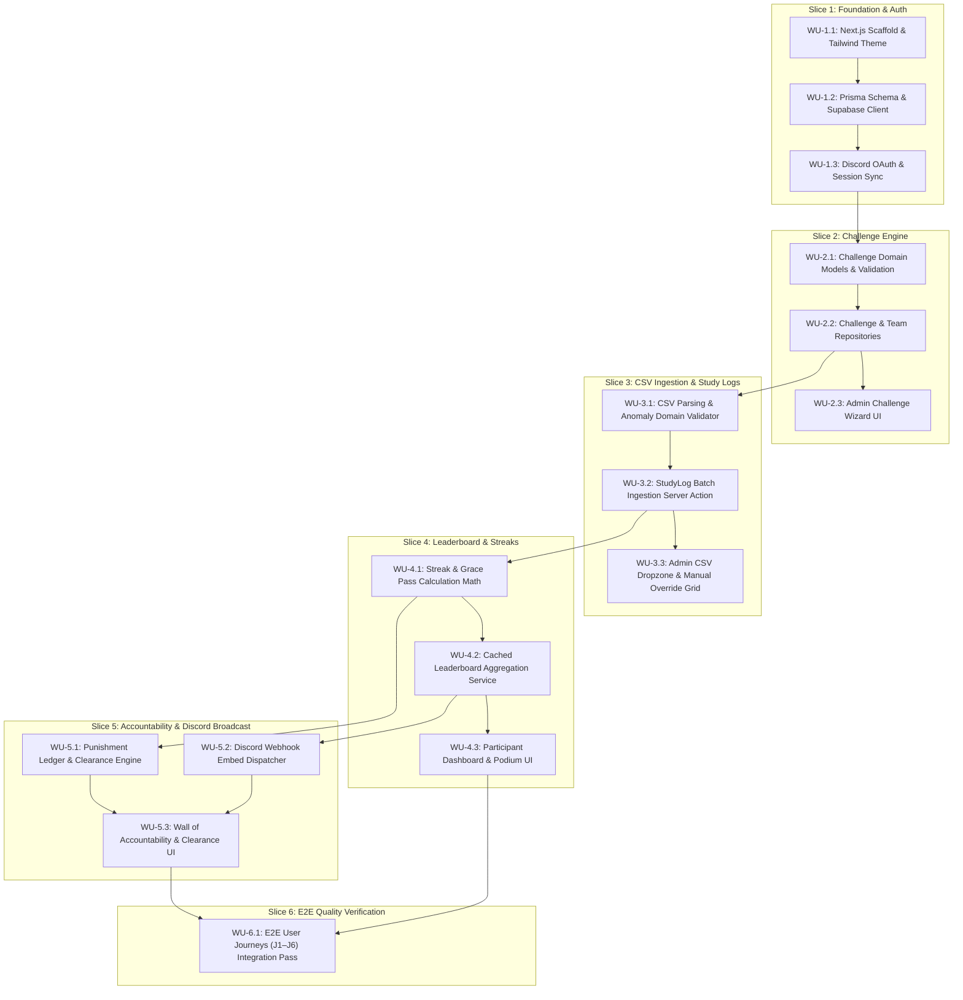

# HoldMeToIt — Comprehensive Multi-Agent Implementation Plan

> **Generated:** 2026-09-03 · **Branch:** `dev`  
> **Goal:** Ship Phase 1 (P0) "Spreadsheet Killer" MVP — fully functional, locally testable, zero-spreadsheet challenge operations.  
> **Tech Stack Status:** **Pending Group Consensus** (The work units below use Candidate A: Next.js + Prisma as the reference plan; commands adapt cleanly if Candidate B or C is ratified).  
> **Source of Truth:** Repository root. Applies to all engineering agents & contributors.  

---

## 1. Current State Assessment

| Component / Layer | Status | Baseline / Current State |
| :--- | :---: | :--- |
| **Documentation Suite** | ✅ Complete | `FEATURES.md`, `AGENTS.md`, `ARCHITECTURE.md` ratified |
| **Tech Stack Consensus**| 🔵 Active | Evaluating Candidate A (Next.js), B (PERN), C (FastAPI) |
| **Project Repository** | ⬜ Queued | Scaffolding waiting on group stack decision |
| **Database & Auth** | ⬜ Queued | Relational schema & Discord OAuth pending |
| **Ingestion Engine** | ⬜ Queued | CSV parser & batch transaction pending |
| **Leaderboard & Streaks**| ⬜ Queued | Pure domain math & ranking views pending |
| **Discord Webhook** | ⬜ Queued | Embed generator & broadcast trigger pending |

---

## 2. Work Unit Design Philosophy

To ensure smooth multi-agent collaboration without context degradation or merge collisions:
- **Session Sizing Budget:**
  - Files per unit: **5–10 files**
  - Lines of code: **300–800 LOC**
  - Scope: **One architectural layer of one vertical slice** (Domain, Data, or Presentation).
  - Target runtime: **30–60 minutes** per unit.
- **Strict Isolation:** Agents working concurrently must work in different feature directories or vertical layers.
- **Zero Ambiguity Verification:** Every Work Unit ends with an executable pass/fail test command.

---

## 3. Dependency Graph (Mermaid DAG)

---

## 4. Slice Breakdown & Concrete Work Units

### Slice 1: Foundation & Auth
#### WU-1.1: Next.js Scaffold & Core Design System
- **Agent:** Core Infrastructure Agent
- **Scope:** Initialize Next.js 14 App Router, TypeScript, Tailwind CSS, Lucide icons, and core layout primitives.
- **Files Created:**
  - `package.json`
  - `tsconfig.json`
  - `tailwind.config.ts`
  - `app/layout.tsx`
  - `app/globals.css`
  - `core/components/ui/button.tsx`
  - `core/components/ui/card.tsx`
- **Verification:** `npm run build` exits with code 0.

#### WU-1.2: Prisma Database Engine & Supabase Setup
- **Agent:** Data & Ingestion Agent
- **Depends on:** WU-1.1
- **Scope:** Define Prisma schema with User, Challenge, Team, TeamMember, StudyLog, and PunishmentLedger models. Setup connection pooling.
- **Files Created:**
  - `prisma/schema.prisma`
  - `core/db/prisma.ts`
  - `prisma/seed.ts`
- **Verification:** `npx prisma validate && npx prisma db push` executes cleanly.

#### WU-1.3: Discord OAuth & User Session Sync
- **Agent:** Participant UI / Auth Agent
- **Depends on:** WU-1.2
- **Scope:** Implement Supabase Discord OAuth authentication route handlers and profile synchronization middleware.
- **Files Created:**
  - `core/auth/supabase-server.ts`
  - `core/auth/supabase-client.ts`
  - `app/api/auth/callback/route.ts`
  - `features/auth/presentation/login-button.tsx`
  - `features/auth/presentation/user-nav.tsx`
- **Verification:** Mock OAuth session creates user in `User` table; `npm run test:auth` passes.

---

### Slice 2: Challenge Management Engine
#### WU-2.1: Challenge Domain Models & Validation Rules
- **Agent:** Scoring & Engine Agent
- **Depends on:** WU-1.3
- **Scope:** Pure domain types, challenge date calculators, mode configuration rules (Solo vs Duo vs Squad), and Zod input validation schemas.
- **Files Created:**
  - `features/challenges/domain/challenge.types.ts`
  - `features/challenges/domain/challenge.schema.ts`
  - `features/challenges/domain/challenge.validator.ts`
  - `tests/unit/challenge-validation.test.ts`
- **Verification:** `npm run test -- test/unit/challenge-validation.test.ts` passes with 6/6 green tests.

#### WU-2.2: Challenge & Team Data Repositories
- **Agent:** Data & Ingestion Agent
- **Depends on:** WU-2.1
- **Scope:** Prisma queries for challenge creation, roster assignment, and team lookups.
- **Files Created:**
  - `features/challenges/data/challenge.repository.ts`
  - `features/challenges/data/team.repository.ts`
- **Verification:** In-memory integration test verifies team creation with $N=1, 2, 4$ members.

#### WU-2.3: Admin Challenge Creator Wizard UI
- **Agent:** Admin Operations Agent
- **Depends on:** WU-2.2
- **Scope:** Multi-step wizard form for hosts to configure challenge rules, mode, weekly targets, grace days, and webhook URL.
- **Files Created:**
  - `app/(admin)/admin/challenges/new/page.tsx`
  - `features/challenges/presentation/challenge-wizard.tsx`
  - `features/challenges/presentation/mode-selector.tsx`
- **Verification:** Form validates inputs and successfully triggers creation server action.

---

### Slice 3: CSV Bulk Ingestion & Study Logs
#### WU-3.1: CSV Parsing & Anomaly Domain Validator
- **Agent:** Scoring & Engine Agent
- **Depends on:** WU-2.2
- **Scope:** Papaparse streaming parser service, column auto-mapping (Name, Date, Duration), anomaly checks (>18 hrs/day flag).
- **Files Created:**
  - `features/study-logs/domain/csv-parser.service.ts`
  - `features/study-logs/domain/csv-schema.ts`
  - `tests/unit/csv-parser.test.ts`
- **Verification:** `npm run test -- test/unit/csv-parser.test.ts` passes (handles YPT exports, empty rows, malformed timestamps).

#### WU-3.2: StudyLog Batch Ingestion Server Action
- **Agent:** Data & Ingestion Agent
- **Depends on:** WU-3.1
- **Scope:** Atomic PostgreSQL batch transaction inserting parsed study logs, resolving participant names to user IDs, and triggering recalculations.
- **Files Created:**
  - `features/study-logs/data/study-log.repository.ts`
  - `app/api/challenges/[id]/import-logs/route.ts`
- **Verification:** Batch test commits 100 rows in $<1.5\text{s}$ or rolls back completely on corrupt foreign keys.

#### WU-3.3: Admin Ingestion Dropzone & Manual Override Grid
- **Agent:** Admin Operations Agent
- **Depends on:** WU-3.2
- **Scope:** Drag-and-drop CSV modal with live mapping preview table, and an inline-editable roster data grid for manual hour corrections.
- **Files Created:**
  - `features/study-logs/presentation/csv-dropzone-modal.tsx`
  - `features/study-logs/presentation/csv-preview-table.tsx`
  - `features/study-logs/presentation/manual-override-grid.tsx`
  - `app/(admin)/admin/challenges/[id]/import/page.tsx`
- **Verification:** Dragging sample CSV renders preview table with recognized/unrecognized user badges.

---

### Slice 4: Scoring, Leaderboard & Streaks
#### WU-4.1: Streak & Grace Pass Domain Math
- **Agent:** Scoring & Engine Agent
- **Depends on:** WU-3.2
- **Scope:** Pure functions computing consecutive study streaks, detecting missed daily/weekly targets, and deducting Grace Passes.
- **Files Created:**
  - `features/leaderboard/domain/streak-calculator.ts`
  - `features/leaderboard/domain/grace-pass.service.ts`
  - `tests/unit/streak-math.test.ts`
- **Verification:** Unit tests verifying: streak increment, streak freeze via grace pass, and streak reset when passes exhausted.

#### WU-4.2: Leaderboard Aggregation Engine
- **Agent:** Data & Ingestion Agent
- **Depends on:** WU-4.1
- **Scope:** High-performance Prisma query aggregating total study hours, team averages, and rank deltas.
- **Files Created:**
  - `features/leaderboard/data/leaderboard.repository.ts`
  - `features/leaderboard/domain/leaderboard.types.ts`
- **Verification:** Query executes in $<200\text{ms}$ on 50 teams with 500 logs.

#### WU-4.3: Participant Dashboard & Podium UI
- **Agent:** Participant UI Agent
- **Depends on:** WU-4.2
- **Scope:** Responsive student dashboard: Target hours gauge ring, 7-day study distribution bar chart, streak counter, and Podium leaderboard tab.
- **Files Created:**
  - `app/(dashboard)/dashboard/page.tsx`
  - `app/(dashboard)/challenge/[id]/page.tsx`
  - `features/leaderboard/presentation/podium-view.tsx`
  - `features/leaderboard/presentation/leaderboard-table.tsx`
  - `features/leaderboard/presentation/streak-badge.tsx`
- **Verification:** Viewport test at 360px and 1440px displays podium and ranking without horizontal scroll.

---

### Slice 5: Accountability Ledger & Discord Broadcaster
#### WU-5.1: Punishment Domain Rules & Repository
- **Agent:** Scoring & Engine Agent
- **Depends on:** WU-4.1
- **Scope:** Trigger logic flagging participants when targets are breached and grace passes are 0. Proof submission and status transitions.
- **Files Created:**
  - `features/accountability/domain/punishment.types.ts`
  - `features/accountability/data/punishment.repository.ts`
  - `tests/unit/punishment-lifecycle.test.ts`
- **Verification:** Lifecycle tests: `FLAGGED` $\rightarrow$ `PROOF_SUBMITTED` $\rightarrow$ `RESOLVED` / `EXCUSED`.

#### WU-5.2: Discord Webhook Embed Dispatcher
- **Agent:** Data & Ingestion Agent
- **Depends on:** WU-4.2, WU-5.1
- **Scope:** Service building Discord Rich Embeds (top 3 podium, Grinder of the Day, and punishment list) and sending via HTTP POST to webhook URL.
- **Files Created:**
  - `features/notifications/domain/discord-embed-builder.ts`
  - `features/notifications/data/webhook-dispatcher.service.ts`
  - `tests/unit/discord-embed.test.ts`
- **Verification:** Unit test validates JSON payload against Discord Webhook API specifications.

#### WU-5.3: Wall of Accountability & Clearance Modal
- **Agent:** Admin Operations / Participant UI Agent
- **Depends on:** WU-5.1, WU-5.2
- **Scope:** Public Wall of Accountability displaying flagged members, and host clearance modal with "Approve Proof" and "Grant Pardon" buttons.
- **Files Created:**
  - `features/accountability/presentation/accountability-wall.tsx`
  - `features/accountability/presentation/punishment-clearance-modal.tsx`
  - `features/notifications/presentation/broadcast-button.tsx`
- **Verification:** Host can click "Approve Proof" to instantly resolve a member's flagged status.

---

### Slice 6: E2E Quality Verification & Release Gate
#### WU-6.1: E2E User Journeys (J1–J6) Integration Suite
- **Agent:** All Collaborating Agents
- **Depends on:** WU-1.1 through WU-5.3
- **Scope:** Playwright automated test suite executing User Journeys J1 through J6.
- **Files Created:**
  - `tests/e2e/j1-auth.spec.ts`
  - `tests/e2e/j2-challenge-setup.spec.ts`
  - `tests/e2e/j3-csv-ingestion.spec.ts`
  - `tests/e2e/j4-manual-override.spec.ts`
  - `tests/e2e/j5-grace-punishment.spec.ts`
  - `tests/e2e/j6-webhook-broadcast.spec.ts`
- **Verification:** `npx playwright test` runs all 6 journeys green. Phase 1 MVP signed off.
