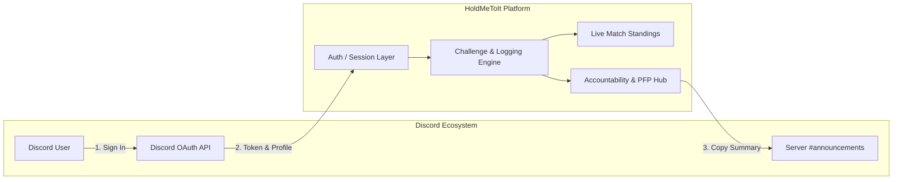
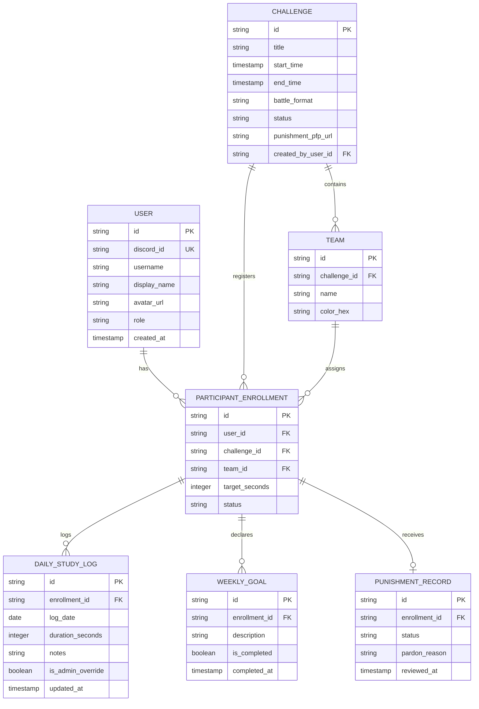

# Software Requirements Specification (SRS)
## Project: HoldMeToIt (Gamified Study Accountability Platform)

> **Document Version:** 1.0  
> **Status:** Draft / Approved for MVP Engineering  
> **Author:** Krish & Core Team  
> **Target Timeline:** 2–3 Weeks Sprint (3–4 Developers)  
> **Technology Stack:** *Stack-Agnostic Architecture Blueprint*  

---

## Table of Contents
1. [Introduction](#1-introduction)  
   1.1 [Purpose](#11-purpose)  
   1.2 [Document Conventions](#12-document-conventions)  
   1.3 [Intended Audience](#13-intended-audience)  
   1.4 [Project Scope & Problem Statement](#14-project-scope--problem-statement)  
2. [Overall System Description](#2-overall-system-description)  
   2.1 [Product Perspective](#21-product-perspective)  
   2.2 [User Classes & Role Permissions](#22-user-classes--role-permissions)  
   2.3 [Operating Environment & Constraints](#23-operating-environment--constraints)  
   2.4 [Design & Architectural Invariants](#24-design--architectural-invariants)  
3. [System Features & Detailed Functional Requirements](#3-system-features--detailed-functional-requirements)  
   3.1 [Module 1: Authentication & Identity Management](#31-module-1-authentication--identity-management)  
   3.2 [Module 2: Challenge Management & Event Lifecycle](#32-module-2-challenge-management--event-lifecycle)  
   3.3 [Module 3: Pre-Challenge Declarations & Goal Setting](#33-module-3-pre-challenge-declarations--goal-setting)  
   3.4 [Module 4: Daily Study Logging & Deficit Engine](#34-module-4-daily-study-logging--deficit-engine)  
   3.5 [Module 5: Standings, Live Scoreboard & Spectator Mode](#35-module-5-standings-live-scoreboard--spectator-mode)  
   3.6 [Module 6: Accountability, Punishment PFP & Clearance](#36-module-6-accountability-punishment-pfp--clearance)  
   3.7 [Module 7: Admin Operations, Manual Overrides & Finalization](#37-module-7-admin-operations-manual-overrides--finalization)  
   3.8 [Module 8: Discord Broadcast Summary Generator](#38-module-8-discord-broadcast-summary-generator)  
4. [Data Model & Logical Schemas (Stack-Agnostic)](#4-data-model--logical-schemas-stack-agnostic)  
5. [Mathematical Formulas & Computational Invariants](#5-mathematical-formulas--computational-invariants)  
6. [Non-Functional Requirements (NFRs)](#6-non-functional-requirements-nfrs)  
7. [Edge Cases & Exception Handling](#7-edge-cases--exception-handling)  
8. [Acceptance Verification Matrix](#8-acceptance-verification-matrix)  

---

## 1. Introduction

### 1.1 Purpose
This Software Requirements Specification (SRS) delineates the complete functional, non-functional, mathematical, and architectural requirements for the Minimum Viable Product (MVP) of **HoldMeToIt**. It serves as the single technical contract for the engineering team, ensuring that every interface, database entity, and business calculation is built without ambiguity or reliance on legacy spreadsheets.

### 1.2 Document Conventions
- **Requirement IDs:** Tagged systematically as `FR-<MODULE>-<NUMBER>` for functional requirements and `NFR-<TYPE>-<NUMBER>` for non-functional requirements.
- **Priority Tags:**
  - `[P0]`: Essential for MVP delivery within the 2–3 week development cycle.
  - `[POST-MVP]`: Explicitly deferred to subsequent iterations.
- **Precision:** All study durations are tracked internally at **second-level precision** ($1\text{ s}$) and displayed in standard clock representation (`HH:MM:SS` or `Xh Ym Zs`).

### 1.3 Intended Audience
This document is designed for the 3–4 developers on the implementation team, QA testers, and community hosts evaluating product fidelity against community challenge needs.

### 1.4 Project Scope & Problem Statement
Discord study servers host recurring high-intensity study duels (e.g., 7-day team sprints like *Bees vs Butterflies*). Currently, organizers spend 5–10 hours weekly manually compiling Yeolpumta (YPT) clock data into Google Sheets, verifying individual target hours, checking off handwritten to-do lists, and hunting down users to apply the server's "Punishment Profile Picture (PFP)." 

**HoldMeToIt** replaces this entire manual loop with a dedicated, automated challenge engine with zero spreadsheet dependencies.

---

## 2. Overall System Description

### 2.1 Product Perspective
HoldMeToIt is an independent web application integrated with the Discord ecosystem via OAuth identity. It acts as the single source of truth for challenge rosters, logged study hours, cumulative scores, and accountability enforcement.

### 2.2 User Classes & Role Permissions

| Role | Definition & Privileges |
| :--- | :--- |
| **Spectator / Public Guest** | Unauthenticated viewer or community lurker. Can view all active challenges, scoreboard totals, team standings, and access the punishment PFP download button. Read-only access. |
| **Enrolled Participant** | Authenticated Discord member registered in a specific challenge. Can declare their weekly target hours and mandatory goals prior to kickoff, log daily study hours in `HH:MM:SS`, and check off completed tasks. |
| **Community Admin / Host** | Server moderator or challenge organizer. Possesses absolute operational control: can create challenges, configure teams, manually override any logged hour or goal state, unlock locked declarations, freeze/lock final numbers, and generate Discord announcement payloads. |

### 2.3 Operating Environment & Constraints
- **Client Devices:** Responsive web client functional across mobile viewports ($360\text{px} - 430\text{px}$) and desktop browsers ($1280\text{px} - 1920\text{px}$).
- **Identity Provider:** Discord OAuth 2.0 (`identify` scope). No local passwords or email registrations.
- **Hosting / Storage:** Relational database with atomic transaction support.
- **Clock Precision:** YPT displays seconds; all system math must record and display down to the second (`HH:MM:SS`).

### 2.4 Design & Architectural Invariants
1. **Spreadsheet Elimination Rule:** If any admin calculation requires an external spreadsheet or manual arithmetic, the system fails acceptance.
2. **The Catch-Up Model (Zero Grace Days):** Grace passes and freeze days are explicitly excluded. Daily deficits accumulate into a weekly target that can be redeemed by studying more on subsequent days.
3. **Hard Punishment Invariant:** Both hours deficit **and** incomplete goals are independent failure conditions. Failing either triggers punishment.
4. **Admin Override Absolute:** In real-world challenges, timers crash, apps freeze, or emergency schedule changes occur. Admins must retain unconditional manual edit capability over any user record.

---

## 3. System Features & Detailed Functional Requirements

### 3.1 Module 1: Authentication & Identity Management

- **FR-AUTH-01 [P0]: Discord OAuth 2.0 Login**  
  The system shall authenticate users via Discord OAuth 2.0 utilizing the `identify` scope. Upon authorization, the system shall retrieve the user's Discord Snowflake ID, username, global display name, and avatar hash.
- **FR-AUTH-02 [P0]: User Record Upsert**  
  The system shall upsert a persistent `User` record on successful authentication. If the record exists, the username, display name, and avatar URL shall be synchronized.
- **FR-AUTH-03 [P0]: Role Resolution**  
  The system shall assign the `PARTICIPANT` role by default. A designated initial system configuration or admin flag shall grant the `ADMIN` role to community hosts.
- **FR-AUTH-04 [P0]: Spectator Fallback (Public Read)**  
  Unauthenticated sessions navigating to any challenge URL shall automatically receive `SPECTATOR` access, enabling viewing of leaderboards without an authentication prompt.

### 3.2 Module 2: Challenge Management & Event Lifecycle

- **FR-CHAL-01 [P0]: Challenge Creation Wizard**  
  Admins shall be able to create a new challenge by specifying:
  - Challenge Title (string, 3–100 chars).
  - Start Timestamp (date-time in server local time).
  - End Timestamp (date-time; must be after Start Timestamp).
  - Battle Format: `TEAM_VS_TEAM`, `DUOS`, or `SOLOS`.
- **FR-CHAL-02 [P0]: Team Configuration & Sizing**  
  For `TEAM_VS_TEAM` and `DUOS`, the host shall create named teams (e.g., *Bees*, *Butterflies*) and assign enrolled participants. The UI shall display a balance indicator to ensure team sizes remain equal wherever possible.
- **FR-CHAL-03 [P0]: Challenge Lifecycle State Machine**  
  The system shall transition challenges through four explicit states:
  $$\text{DRAFT} \longrightarrow \text{UPCOMING} \longrightarrow \text{ACTIVE} \longrightarrow \text{COMPLETED}$$
  - `DRAFT`: Configurable by host only; invisible to public.
  - `UPCOMING`: Publicly visible; participants enroll and submit declarations.
  - `ACTIVE`: Start time reached; declarations lock; daily logging open.
  - `COMPLETED`: Host locks the challenge; final standings and punishments frozen.
- **FR-CHAL-04 [P0]: Event Lockdown Enforcement**  
  When an event transitions to `COMPLETED`, all participant logging inputs and task checkboxes shall be rendered disabled (`readonly`).

### 3.3 Module 3: Pre-Challenge Declarations & Goal Setting

- **FR-DECL-01 [P0]: Target Hours Declaration**  
  Prior to the challenge start time (`UPCOMING` state), each participant must declare a weekly study target in `HH:MM:SS` (minimum $1\text{ hour}$, maximum $120\text{ hours}$).
- **FR-DECL-02 [P0]: Mandatory Weekly Goals List**  
  Prior to challenge kickoff, each participant must submit between $1$ and $10$ discrete text-based goal items (e.g., *"Finish Physics Mechanics modules"*).
- **FR-DECL-03 [P0]: Pre-Kickoff Lock Invariant**  
  Once the challenge transitions to `ACTIVE` (event start timestamp reached), declared target hours and goal descriptions shall become strictly read-only for participants.
- **FR-DECL-04 [P0]: Host Goal Unlock / Edit**  
  Admins shall possess the ability to unlock or directly edit a participant's declared goals mid-event if personal circumstances or course syllabi change.

### 3.4 Module 4: Daily Study Logging & Deficit Engine

- **FR-LOG-01 [P0]: Clock-Time Duration Input**  
  Participants shall log study sessions for any valid date within the challenge duration using three numeric fields: `Hours` ($0–24$), `Minutes` ($0–59$), and `Seconds` ($0–59$).
- **FR-LOG-02 [P0]: Single-Day Validation Limit**  
  The sum of logged durations for a single participant on a single calendar day shall not exceed $86,400\text{ seconds}$ ($24\text{ hours}$).
- **FR-LOG-03 [P0]: Daily Task Check-off**  
  During an `ACTIVE` challenge, participants can toggle completion checkboxes for their declared weekly goals. Checkbox state changes must persist immediately.
- **FR-LOG-04 [P0]: Dynamic Catch-Up Pace Calculation**  
  The participant cockpit shall dynamically compute and display the required daily pace:
  $$\text{Required Pace} = \frac{\max(0, \text{Target Seconds} - \text{Logged Seconds})}{\text{Days Remaining in Challenge}}$$
  If the participant is ahead of pace, the UI shall display *"On Track (+Xh Ym ahead)"*.

### 3.5 Module 5: Standings, Live Scoreboard & Spectator Mode

- **FR-LEAD-01 [P0]: Head-to-Head Banner (Team vs Team)**  
  In `TEAM_VS_TEAM` mode, the top of the challenge view shall render a live scoreboard displaying:
  - Team Name & Roster Count for both teams.
  - Cumulative Total Logged Time (`HH:MM:SS`).
  - Leading Team Banner and Lead Delta (`+Xh Ym Zs ahead`).
- **FR-LEAD-02 [P0]: Unified Standings Table**  
  The standings table shall display every participant ordered by total logged hours descending:
  - Columns: Rank, Member (Avatar + Discord Name), Team Tag, Total Logged (`HH:MM:SS`), Declared Target (`HH:MM:SS`), Target Completion Percentage, Weekly Goals Status ($M/N\text{ completed}$), Current Status (`ON_TRACK` / `AT_RISK`).
- **FR-LEAD-03 [P0]: Filter Tabs**  
  Users can filter the standings table by `All Participants`, `Team A`, or `Team B`.
- **FR-LEAD-04 [P0]: Real-Time Data Freshness**  
  Leaderboard rankings must update immediately upon new study log submissions or admin manual adjustments without page cache delay ($<500\text{ms}$).

### 3.6 Module 6: Accountability, Punishment PFP & Clearance

- **FR-PUN-01 [P0]: Automated Punishment Flagging**  
  Upon event closure, the system shall evaluate every enrolled participant. A participant is flagged (`PUNISHED`) if:
  $$\text{Logged Seconds} < \text{Target Seconds} \quad \lor \quad \text{Completed Goals} < \text{Total Declared Goals}$$
- **FR-PUN-02 [P0]: Punishment Wall Roster**  
  A dedicated section on the challenge page shall highlight all flagged members alongside their missing hours deficit and incomplete tasks.
- **FR-PUN-03 [P0]: Punishment PFP Direct Asset Download**  
  The platform shall provide an accessible **"Download Punishment PFP"** button. Clicking this downloads the challenge's official punishment image file directly to the user's device, removing the need to search Discord chat history.
- **FR-PUN-04 [P0]: Host Pardon Override**  
  Admins shall have the authority to update any flagged participant's status to `EXCUSED` with an optional note (e.g., *"Medical emergency approved by host"*).

### 3.7 Module 7: Admin Operations, Manual Overrides & Finalization

- **FR-ADM-01 [P0]: Inline Hours Override Table**  
  Admins shall have access to an administrative data grid listing all participant daily entries. The admin can directly modify any day's `Hours`, `Minutes`, or `Seconds` to fix user typos or timer glitches.
- **FR-ADM-02 [P0]: Audit Logging**  
  Whenever an admin alters a participant's logged hours or goal states, the record shall be flagged with `is_override = true` and record the admin's User ID.
- **FR-ADM-03 [P0]: Lock & Finalize Action**  
  A prominent "Finalize Challenge & Lock Results" action shall execute the final punishment calculation, freeze all data rows, and change status to `COMPLETED`.

### 3.8 Module 8: Discord Broadcast Summary Generator

- **FR-DISC-01 [P0]: Formatted Summary Generation**  
  The system shall compile an emoji-rich Markdown text block summarizing event results upon admin request:
  - Event Name & Duration.
  - Winning Team & Final Scoreboard.
  - Top Individual Grinders (Podium: 🥇, 🥈, 🥉).
  - Total Server Hours Studied.
  - Punishment Wall (List of Discord mentions/handles requiring the Punishment PFP).
- **FR-DISC-02 [P0]: 1-Click Clipboard Copy**  
  The admin console shall include a single-click "Copy Discord Announcement" button with instant visual feedback (*"Copied to clipboard!"*).

---

## 4. Data Model & Logical Schemas (Stack-Agnostic)

The platform requires a relational schema to preserve team relationships, daily log integrity, and auditability.

---

## 5. Mathematical Formulas & Computational Invariants

### 5.1 Clock Decomposition & Parsing
Input clock values from the client must be validated and converted to raw seconds before database insertion:
$$\text{Seconds}_{\text{total}} = (H \times 3600) + (M \times 60) + S$$
Where $H \in [0, 24]$, $M \in [0, 59]$, $S \in [0, 59]$, and $\text{Seconds}_{\text{total}} \le 86,400$.

Formatted output back to user interfaces:
$$H = \lfloor \text{Seconds}_{\text{total}} / 3600 \rfloor$$
$$M = \lfloor (\text{Seconds}_{\text{total}} \pmod{3600}) / 60 \rfloor$$
$$S = \text{Seconds}_{\text{total}} \pmod{60}$$
$$\text{Display Clock} = \text{pad2}(H) : \text{pad2}(M) : \text{pad2}(S)$$

### 5.2 Team Cumulative Score Aggregation
For team $T$ containing members $\{m_1, m_2, \dots, m_k\}$:
$$\text{TeamScore}_T = \sum_{i=1}^{k} \sum_{d \in \text{Days}} \text{DurationSeconds}(m_i, d)$$
$$\text{LeadDelta} = |\text{TeamScore}_{A} - \text{TeamScore}_{B}|$$

### 5.3 Daily Deficit & Pace Requirement
For a participant with target $T_{\text{sec}}$, current logged sum $L_{\text{sec}}$, and remaining active challenge days $D_{\text{rem}}$:
$$\text{Deficit} = \max(0, T_{\text{sec}} - L_{\text{sec}})$$
$$\text{DailyPace} = \begin{cases} \lceil \text{Deficit} / D_{\text{rem}} \rceil & \text{if } D_{\text{rem}} > 0 \\ \text{Deficit} & \text{if } D_{\text{rem}} = 0 \end{cases}$$

### 5.4 Punishment Predicate
At challenge conclusion, evaluation evaluates as:
$$\text{Condition}_{\text{hours}} = (\sum \text{DurationSeconds} < T_{\text{sec}})$$
$$\text{Condition}_{\text{goals}} = \exists g \in \text{Goals} : g.\text{is\_completed} = \text{false}$$
$$\text{IsFlagged} = \text{Condition}_{\text{hours}} \lor \text{Condition}_{\text{goals}}$$

---

## 6. Non-Functional Requirements (NFRs)

### 6.1 Performance & Latency
- **NFR-PERF-01:** The main challenge scoreboard and standings table must render in under **$400\text{ms}$** under typical server payload ($100$ participants, $700$ daily log records).
- **NFR-PERF-02:** Logging a daily study duration must process and reflect in local standings within **$<300\text{ms}$**.

### 6.2 Security & Authorization
- **NFR-SEC-01:** Role-Based Access Control (RBAC) must strictly prohibit non-admin users from triggering overrides, modifying another user's hours, or finalizing events.
- **NFR-SEC-02:** All input durations must be sanitized to eliminate integer overflows, negative durations, or invalid clock strings.

### 6.3 Usability & Viewport Responsiveness
- **NFR-UX-01:** The web client must be fully usable without horizontal scroll on mobile devices ($360\text{px}$ width), specifically ensuring the study logging card and standings table adapt cleanly.
- **NFR-UX-02:** Clock inputs must support numeric keypad entry on mobile keyboards.

### 6.4 Data Reliability
- **NFR-REL-01:** All calculations (aggregates, deficits, percentages) must be computed from underlying normalized atomic log entries rather than cached scalar counters that could fall out of sync.

---

## 7. Edge Cases & Exception Handling

| Edge Case Scenario | Expected System Behavior |
| :--- | :--- |
| **Participant forgets to log hours for 2 days.** | The user can select the past date from the date dropdown and enter their hours. The system updates historical totals and recalculates the deficit. |
| **Participant accidentally logs 40 hours in one day.** | Input validation rejects values $>24\text{ hours}$ ($86,400\text{s}$) with the error message: *"Daily duration cannot exceed 24 hours."* |
| **Event starts, but a member needs to change goals.** | Goals are locked to prevent cheating. The member requests an edit from the host; the host uses the Admin Goal Editor to modify or unlock the goal. |
| **Team sizes become uneven due to a drop-out.** | The host can remove or reassign the inactive participant before final locking. Team score reflects active enrolled members. |
| **Timer app crash during study session.** | The participant alerts the host. The host uses the Admin Manual Override Grid to input the verified missing study hours with an audit flag. |
| **Legitimate illness causes missed target.** | The system flags the member as `PUNISHED`. The host opens the review dialog and marks the member `EXCUSED`, exempting them from the Punishment PFP. |

---

## 8. Acceptance Verification Matrix

| Verification ID | Trigger / Action | Expected Result | Pass Criteria |
| :--- | :--- | :--- | :---: |
| **V-01: Discord Sign-In** | User clicks "Login with Discord" on public landing page. | Authenticates via OAuth; redirects to dashboard with user avatar and handle displayed. | ✅ Profile created in DB; session active. |
| **V-02: Challenge Setup** | Admin creates a 7-day *Bees vs Butterflies* team challenge. | Challenge persists in `UPCOMING` state; both teams visible on scoreboard. | ✅ Challenge and Team entities created. |
| **V-03: Pre-Event Lock** | Participant declares $35\text{h}$ and 3 goals. Challenge start time is reached. | Declaration fields transition to disabled/read-only state. | ✅ Participant cannot edit target or goal text. |
| **V-04: Daily Study Logging** | Participant inputs `04h 30m 00s` for Day 1. | Day 1 log saved; user total shows `04:30:00`; team total increments by exact amount. | ✅ Leaderboard reflects new total in $<400\text{ms}$. |
| **V-05: Catch-Up Pacing** | Participant logs $0\text{h}$ for Day 2. | Deficit pace indicator recalculates remaining hours divided by remaining days. | ✅ Math matches formula 5.3 exactly. |
| **V-06: Admin Override** | Host modifies a participant's Day 1 log from `4h` to `6h`. | Value updates to `06:00:00`; audit tag `is_admin_override` set to true. | ✅ Standings update immediately. |
| **V-07: Punishment Flagging** | Admin clicks "Lock Challenge" when a participant has $32\text{h} / 35\text{h}$. | System sets status to `PUNISHED` and places member on Punishment Wall. | ✅ Member flagged; PFP download link active. |
| **V-08: Discord Broadcast** | Admin clicks "Copy Discord Summary". | Formatted text copied to clipboard with winner banner and punishment roster. | ✅ Clipboard contains verified markdown text. |
