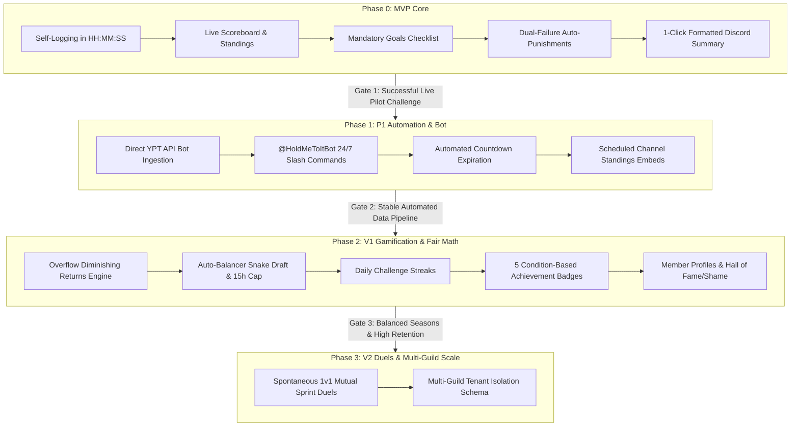

# HoldMeToIt — Product & Technical Evolution Roadmap (MVP → P1 → V1 → V2)

> **Document Type:** Product & Technical Evolution Roadmap  
> **Audience:** Engineering Team (3–4 Developers), Community Moderators & Stakeholders  
> **Cadence:** Milestone-Gated Evolution (Sprints planned dynamically per phase)  
> **Reference Stack:** Next.js (App Router), TypeScript, Tailwind CSS, shadcn/ui, Prisma, PostgreSQL (Supabase/Neon), Auth.js (Discord OAuth), Vitest, Vercel  

---

## 1. Phased Trajectory & Evolution Pipeline

HoldMeToIt evolves sequentially across four distinct maturity phases. Progress between phases is governed by **Milestone Quality Gates** rather than arbitrary calendar deadlines:



---

## 2. Technical Architecture & Component Evolution

The technical architecture is designed to scale modularly as new phases unlock:

```
HoldMeToIt Architecture Evolution
├── Client / Presentation Layer
│   ├── Next.js 14+ (App Router), React, Tailwind CSS, shadcn/ui
│   ├── Phase 0: Participant cockpit, match scoreboard, admin override grid
│   ├── Phase 1: Countdown ticker, live embed previews
│   ├── Phase 2: Profile showcases, badge showcases, draft workbench
│   └── Phase 3: 1v1 Duel arena modal
│
├── Business Logic & Service Layer
│   ├── Next.js Server Actions & Route Handlers
│   ├── Phase 0: Clock converters (`HH:MM:SS`), deficit pace engine, punishment validator
│   ├── Phase 1: YPT payload validator, countdown state machine
│   ├── Phase 2: Diminishing returns calculator, snake-draft auto-balancer
│   └── Phase 3: P2P duel challenge handshake service
│
├── Identity & Access
│   ├── Auth.js (Discord OAuth 2.0 Provider — `identify` scope)
│   ├── Session-based RBAC: `SPECTATOR` → `PARTICIPANT` → `ADMIN`
│   └── Phase 3: Multi-guild permission resolver
│
├── Bot & Daemon Infrastructure (Phase 1+)
│   ├── Node.js Discord.js service (`@HoldMeToItBot`)
│   ├── Inter-service communication via secured bearer token API routes
│   └── Scheduled task runners for midnight check-ins and final announcements
│
├── Persistence Layer
│   ├── Prisma ORM querying PostgreSQL (Supabase / Neon)
│   └── Migration-controlled schema updates per phase
│
└── Quality Assurance & Infrastructure
    ├── Vitest (domain math unit tests & calculation invariants)
    └── Vercel Hosting + GitHub Actions CI/CD
```

---

## 3. Phase 0 (MVP Core): The Spreadsheet Exorcism

### 3.1 Strategic Objective
Eradicate manual host labor. Deliver a robust, reliable web application capable of running a full community study battle from kickoff to punishment resolution with zero reliance on Google Sheets.

### 3.2 Core Capabilities
1. **Discord OAuth Authentication:** One-click login; automatic avatar and display name sync; fallback spectator mode.
2. **Multi-Format Challenge Creator:** Host-configured battles supporting `TEAM_VS_TEAM` (e.g. *Bees vs Butterflies*), `DUOS` ($N=2$), and `SOLOS` ($N=1$).
3. **Pre-Event Declarations:** Mandatory submission of weekly target hours (`HH:MM:SS`) and weekly to-do list tasks; strict lock invariant once the challenge goes `ACTIVE`.
4. **Clock-Time Self-Logging:** Daily hours entry in `HH:MM:SS` format with a 24-hour single-day safety limit.
5. **Head-to-Head Live Scoreboard:** Team totals, current leader, lead margin delta, and unified participant leaderboard.
6. **Dynamic Deficit Tracker:** Real-time catch-up pace indicator showing exact hours/day needed over remaining days.
7. **Dual-Failure Auto-Punishment:** Auto-flags participants who fail their hours target OR leave declared tasks unfinished.
8. **Direct Punishment PFP Download:** Instant one-click download of the punishment asset directly from the web app.
9. **Admin Manual Override Grid:** Host inline-edit capability to adjust any participant's logged hours or unlock tasks in case of emergency.
10. **1-Click Discord Summary Generator:** Formatted markdown text generator ready to copy-paste into `#study-announcements`.

### 3.3 Database Entities at Phase 0
- `User` (Discord identity, role)
- `Challenge` (title, timestamps, format, status)
- `Team` (name, color, challenge relation)
- `ParticipantEnrollment` (target seconds, status)
- `DailyStudyLog` (date, duration seconds, override flag)
- `WeeklyGoal` (description, completion boolean)
- `PunishmentRecord` (flagged status, pardon notes)

### 3.4 Phase 0 Milestone Gate (Promotion to P1)
- [ ] Successful deployment to staging/production on Vercel.
- [ ] 100% test coverage on domain calculation formulas (`HH:MM:SS` parsing, deficit pacing, punishment evaluation).
- [ ] **Live Pilot Challenge:** Run 1 full community challenge with real users, using a shadow Google Sheet as a fallback safety net to verify zero calculation divergence.

---

## 4. Phase 1 (P1): Automation & Integrations

### 4.1 Strategic Objective
Eliminate manual self-logging friction by connecting an automated YPT data ingestion bridge, deploying an interactive Discord bot, and automating event lifecycle transitions.

### 4.2 Core Capabilities

#### 4.2.1 Direct YPT API Bot Ingestion Engine
- **Context:** An independent YPT scraper/bot built by a teammate streams verified study times directly to HoldMeToIt.
- **Ingestion Route (`POST /api/v1/ingest/ypt`):**
  - Authenticated via secure pre-shared Bearer API Token.
  - Payload Schema:
    ```json
    {
      "discordId": "3141592653589793",
      "challengeId": "clx...",
      "date": "2026-09-08",
      "durationSeconds": 16200,
      "yptSubject": "Mathematics"
    }
    ```
  - Upserts atomic `DailyStudyLog` records and triggers immediate recalculation of team scores and individual pace.
- **Resilience:** If the scraper experiences network hiccups or YPT session expiration, the system allows participants to self-log manually on the web as a fallback.

#### 4.2.2 24/7 `@HoldMeToItBot` Discord Bot
- **Slash Commands:**
  - `/stats [user]` — Returns rich Discord embed showing user's daily hours, weekly target progress, and goal checklist.
  - `/standings` — Returns current team scores, lead delta, and individual top 3 podium.
  - `/deficit` — Displays remaining hours and required daily pace to stay out of the punishment bracket.
- **Scheduled Automated Broadcasts:**
  - Mid-day check-in embed automatically posted to `#study-announcements`.
  - Final results announcement embed automatically dispatched when the event concludes.

#### 4.2.3 Event Timer & Automated Countdown Expiration
- **Host Manual Kickoff:** Hosts retain explicit control over when an event starts to ensure rosters are finalized.
- **Automated Expiration:** Once the end timestamp expires:
  - System flips challenge status: `ACTIVE → COMPLETED`.
  - Freezes all logging forms and inputs immediately.
  - Executes the punishment evaluation routine and updates the Punishment Wall.

### 4.3 Database Schema Additions (P1)
- `ApiKey` (stores hashed tokens for teammate YPT bot authorization)
- `BotBroadcastLog` (audit records of automated Discord channel embeds sent)

### 4.4 Phase 1 Milestone Gate (Promotion to V1)
- [ ] Continuous 7-day automated YPT data ingestion without dropouts or duplicate entries.
- [ ] `@HoldMeToItBot` responds to slash commands with latency $<800\text{ms}$.
- [ ] Challenge auto-completes and accurately flags punishments without host intervention.

---

## 5. Phase 2 (V1): Gamification, Retention & Fair Balancing

### 5.1 Strategic Objective
Introduce advanced competitive fairness mechanics, prevent single-player carry imbalance, reward consistency through daily streaks, and cultivate long-term community pride through member profiles and achievement badges.

### 5.2 Core Capabilities

#### 5.2.1 Overflow Hours & Diminishing Returns Engine
- **The Problem:** In team battles, one participant studying 16 hours/day when they committed to 4 hours/day creates massive score distortion, demoralizing the competing team.
- **The Solution:** Dual-Credit Scoring Architecture:
  1. **Personal Profile & Badges:** The grinder receives **100% full credit** for all logged hours. No hard effort is ever discarded or demeaned.
  2. **Team Battle Match Score:** Hours beyond the declared daily commitment apply a damping factor ($\alpha = 0.50$) to preserve balanced team competition.
- **Piecewise Mathematical Formula:**
  For a day with declared daily target $T_{\text{daily}} = T_{\text{weekly}} / 7$ and logged time $L$:
  $$\text{TeamScore}_{\text{day}} = \begin{cases} L & \text{if } L \le T_{\text{daily}} \\ T_{\text{daily}} + 0.50 \times (L - T_{\text{daily}}) & \text{if } L > T_{\text{daily}} \end{cases}$$

#### 5.2.2 Auto-Balancer Snake Draft & 15-Hour Cap
- **15-Hour Daily Cap:** Declared targets cannot exceed $15\text{ hours/day}$ ($105\text{ hours/week}$) to safeguard member well-being and prevent fraudulent claims.
- **Algorithmic Snake Draft:**
  - Calculates a composite expected capacity for each member:
    $$\text{Rating}_i = 0.6 \times \text{DeclaredDailyTarget}_i + 0.4 \times \text{HistoricalDailyAverage}_i$$
  - Sorts participants descending by $\text{Rating}_i$ and executes an alternating snake draft ($A, B, B, A, A, B\dots$) to produce rosters with nearly identical total projected hours.
  - **Host Override Workbench:** Interactive drag-and-drop roster editor allowing mods to swap participants before confirming the draft.

#### 5.2.3 Daily Challenge Streaks
- **Mechanic:** A participant's daily streak increments by 1 for every challenge day where logged hours $\ge 100\%$ of their daily target pace.
- **Reset Invariant:** If an active challenge day ends with $0$ hours logged, the daily streak resets to $0$.

#### 5.2.4 Condition-Based Achievement Badges
| Badge | Title | Condition Trigger |
| :---: | :--- | :--- |
| 🏛️ | **Centurion** | Accumulate $\ge 100\text{ hours}$ of verified lifetime study time. |
| 🦉 | **Night Owl** | Accumulate $\ge 30\text{ hours}$ between 10:00 PM and 4:00 AM. |
| 🎯 | **Flawless Grinder** | Achieve $100\%$ of target hours AND $100\%$ of weekly goals in an event. |
| ⚡ | **Comeback Kid** | Overcome a $>5\text{-hour}$ deficit in the final 48 hours to pass target. |
| ⚔️ | **Veteran** | Complete 5 community challenge seasons. |

#### 5.2.5 Member Profile Cockpit (`/profile/[discordId]`)
- Total lifetime verified study time (`HH:MM:SS`).
- Team battle Win/Loss record.
- Current active daily streak.
- Unlocked achievement badges showcase.
- **Hall of Accountability Archive:** Public tally of successful completions vs times assigned the Punishment PFP.

### 5.3 Database Schema Additions (V1)
- `UserBadge` (relation linking `User` to `BadgeDefinition` with earned timestamp)
- `StreakRecord` (current streak, longest streak, last increment date)
- `HistoricalSeasonRecord` (archived snapshot of past battle placements and stats)

### 5.4 Phase 2 Milestone Gate (Promotion to V2)
- [ ] Diminishing returns formula mathematically verified across $50+$ simulated battle scenarios.
- [ ] Auto-balancer produces rosters with $<5\%$ delta in projected team capacity.
- [ ] Profile pages render dynamic user statistics in $<300\text{ms}$.

---

## 6. Phase 3 (V2): Spontaneous Duels & Scale Readiness

### 6.1 Strategic Objective
Empower community members to challenge friends to quick study sprints on demand without moderator overhead, while establishing multi-tenant database isolation to allow other Discord communities to onboard.

### 6.2 Core Capabilities

#### 6.2.1 Spontaneous 1v1 Mutual Study Sprint Duels
- **Concept:** Informal peer-to-peer study sprints (e.g. 1-hour, 2-hour, or single-day duels) initiated between two friends.
- **Lifecycle Flow:**
  ```mermaid
  sequenceDiagram
      autonumber
      participant A as Member A
      participant Bot as "@HoldMeToItBot / Web"
      participant B as Member B
      participant Sys as Duel Engine
      A->>Bot: /duel challenge @MemberB duration:2h
      Bot->>B: Notification: "Member A challenged you to a 2h Study Duel!"
      B->>Bot: Accept Duel
      Bot->>Sys: Create temporary Duel Arena
      Sys->>Sys: Live Countdown & YPT sync
      Sys->>Bot: Timer Expired → Announce Winner
  ```
- **Zero Moderator Burden:** Sprints operate autonomously; no admin approval or management required.

#### 6.2.2 Multi-Guild Database Preparation
- Introduce optional `guild_id` foreign key relations across `Challenge`, `User`, and `Team`.
- Decouples community-specific configurations (e.g. punishment PFP assets, announcement channels), enabling HoldMeToIt to be added to external Discord servers.

### 6.3 Database Schema Additions (V2)
- `Duel` (initiator_id, opponent_id, duration_seconds, status, winner_id)
- `GuildConfig` (guild_id, announcement_channel_id, admin_role_id)

---

## 7. Master Comparison Across All Phases

| Dimension | Phase 0 (MVP) | Phase 1 (P1) | Phase 2 (V1) | Phase 3 (V2) |
| :--- | :---: | :---: | :---: | :---: |
| **Study Logging** | Manual Web (`HH:MM:SS`) | Automated YPT Bot + Web | Automated YPT Bot + Web | Automated YPT Bot + Web |
| **Discord Interface** | 1-Click Clipboard Copy | `@HoldMeToItBot` Slash Commands | `@HoldMeToItBot` + Embeds | Bot + `/duel` Commands |
| **Event Expiration** | Host Manual Lock | Automated Timer Expiration | Automated Timer Expiration | Automated Timer Expiration |
| **Team Rostering** | Manual Host Assign | Manual Host Assign | **Auto-Balancer Snake Draft** | Auto-Balancer Snake Draft |
| **Daily Target Cap** | Uncapped | Uncapped | **15 Hours / Day Cap** | 15 Hours / Day Cap |
| **Overflow Scoring** | 100% Linear | 100% Linear | **Diminishing Returns ($\alpha=0.5$)** | Diminishing Returns |
| **Streaks & Badges** | ❌ | ❌ | **Daily Streaks + 5 Badges** | Streaks + Badges |
| **Member Profiles** | Basic Dashboard | Basic Dashboard | **Full `/profile` + Hall of Fame** | Full `/profile` + Duel Stats |
| **P2P Study Duels** | ❌ | ❌ | ❌ | **Mutual 1v1 Sprints** |
| **Multi-Server** | Single Server | Single Server | Single Server | **Multi-Guild Schema** |

---

## 8. Technical Risk Management & Mitigations

| Risk | Impact | Likelihood | Technical Mitigation Strategy |
| :--- | :---: | :---: | :--- |
| **Teammate YPT Bot Downtime** | High | Medium | Keep manual web self-logging fully functional as an active fallback. The system never blocks user input if the scraper drops. |
| **Discord Rate Limiting** | Medium | Low | Queue channel announcements and bot responses; use webhooks with exponential backoff. |
| **Extreme Outlier Skew** | High | High | Addressed in Phase 2 via the 15h daily target cap and the 0.50 diminishing returns formula on team scores. |
| **Timer / Input Disputes** | Medium | Medium | Mitigated via the Admin Manual Override Grid with `is_admin_override` audit logging. |
| **Data Loss During Live Battle** | Critical | Low | Relational PostgreSQL persistence with atomic database transactions; daily backup snapshots on Supabase/Neon. |
